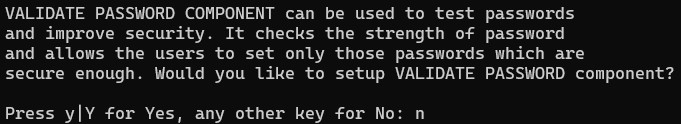
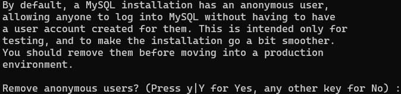
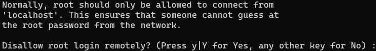
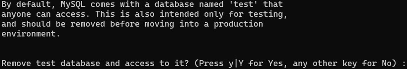

# Practical 1
## Install MySQL

We are going to deploy MySQL on your Linux VM from the CLI. 

There are many GUI options available which can make it easier to create and manage databases, tables, and records. But if you learn a GUI, then you tend to only know that GUI, if we learn the concepts through the CLI it's easier to apply them to any environment.

### Restore Your VM

You should have a snapshot of your VM upon it's initial first boot, restore to this snapshot. We do not want anything to do with any of your Linux labs running.

If you do not have a first boot snapshot, it is recommended that you re-import your VM and take one. 

If it has been a while since your first snapshot, you may want to update your O/S with

```bash
sudo yum update
```

### Install MySQL

Hopefully many of the following steps are familiar to you by now. When ready, install MySQL Server with:

```bash
sudo yum install mysql-server
```

Confirm the installation (or use the -y option to bypass) and wait till it completes. 

Once done we need to start the service:

```bash
sudo systemctl start mysqld
```

**Notice we're starting the deamon**

Enable the service, so that it starts automatically following a reboot:

```bash
sudo systemctl enable mysqld
```

Then confirm the previous steps worked correctly:

```bash
sudo systemctl status mysqld
```

### Configure MySQL

MySQL is now installed and running, but it requires some initial configuration before we can access it. Run the following command to complete the setup:

```bash
mysql_secure_installation
```

An installation script will run prompting you to answer some questions about your desired setup. 

**NOTE: We're going to intentionally choose options which make our life easier, but make our database vulnerable. These are not the best options in the real-world.**

The first question is:



Basically asking if you want MySQL to enforce strong passwords, great in theory, but we're going to say ```N``` for No.

Next you'll be prompted to set the root user's password, set it as ```root```. 

**NOTE: Just like when logging into Linux, there is no on-screen indication of your input, so type carefully.**

You'll be asked to enter the same password again to confirm.

The next question is about permitting anonymous users. This might be useful in some scenarios, but usually a risk, so not advised, we can respond ```Y``` to remove them.



Next we can permit or deny remote access for the root user. From a security POV this is not advised, because a malicous user who gets the root credentials can get full unrestricted access to our data from outside our network. For now we can answer ```Y``` to disallow remote login because we are using the localhost, but if deploying to the cloud you may want this ability enabled.



The next question is about a test database, we can remove it because we're going to create our own, so answer ```Y```:



The final question prompts you to reload the privileges table, so that your changes take immediate effect. We want to do this, so answer ```Y```:


If everything works you should get an ```All Done!``` message and be returned to your Linux prompt.

### Logging into MySQL

MySQL should be installed and configured, so you can log in with the following command:

```
mysql -u root -p
```

The ```-u``` option specifies the username, we're logging in as root, press enter and you'll be prompted for your password, which should also be ```root```. If successful your prompt should change to the below example, as you're now in the MySQL application:

```
mysql>
```

Exit MySQL and return to Linux with ```exit```.
