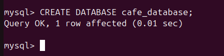
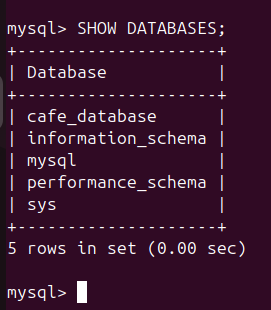
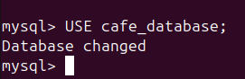
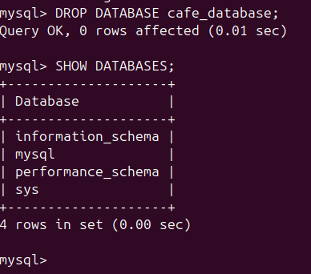

# Practical 2
## Creating Databases and Tables

To summarize the main content so far:
- We use database software such as MySQL to create individual databases. 
- Databases contain tables, and there can be multiple tables in a database.
- A table is comprised of fields, which are strictly defined for their data type, size, and other properties. 
- This definition is known as a Schema.

All of this is done using a language called Structured Query Language (SQL). In this task you're going to practice creating databases and tables by defining our fields, using SQL commands.

In this first section of the practical, your objective is just to practice and build familiarity with the commands and syntax. So you should just choose your own example DB names, table names, and fields. You're going to drop the tables at the end of this section anyway, so it doesn't matter.

### Database Commands

Below is a reminder of the different commands we've seen so far, you should try to use all of them. If you're not sure about a command go back and review the relevant section, or ask for help.

```sql
CREATE DATABASE db_name;

SHOW DATABASES;

USE db_name;

DROP DATABASE db_name;
```

Recall the use cases for the above commands:

- `CREATE DATABASE db_name`: This SQL statement creates an empty database for you to use. This is where you can store data, manage tables... loads of things! Type this into your terminal and see what happens!


- `SHOW DATABASES`: This is a way to list all of the databases you are able to access. After creating your database, you could use this to confirm your database was created and that you have permission to be able to access it.


- `USE db_name`: Rather than needing to explicitly specify what database to access and run queries to, you can choose an active database to run any subsequent SQL queries on.    


- `DROP DATABASE db_name`: Unhappy with your database? Use this command to delete the database, including all of it's content' permanently. ***NOTE: This is irreversible, so use with caution. Once you have deleted your database, you can use `SHOW DATABASES` to confirm its deletion.***


When you are finished practicing each of the commands, try answering the reflection questions in the next section.

### Reflection Questions

1. What do you think would happen if you try to `USE` a database that does not exist?
2. Why is it important to double check before dropping a database?
3. If you `CREATE DATABASE` with the same name as an existing database, what will happen?
4. What could happen if you accidentally run `DROP DATABASE` on a production database? How would you prevent such mistakes?

Now that you have taken some time to practice the above commands yourself, let's move onto a challenge.

### WANTED: Confident Azure Practitioners - Part 1

Recall your project from the Python unit, where you helped a cafe create a terminal based application for employees and customers to use. This cafe was so impressed with your work, they decided to hire you again for your support. This time the cafe is requesting a database to help persist customer data and its growing list of products.

***For this practical, you are tasked with creating a database that the cafe can use for its operations. Keep this database, as you will build on it as you work through the practicals.***
