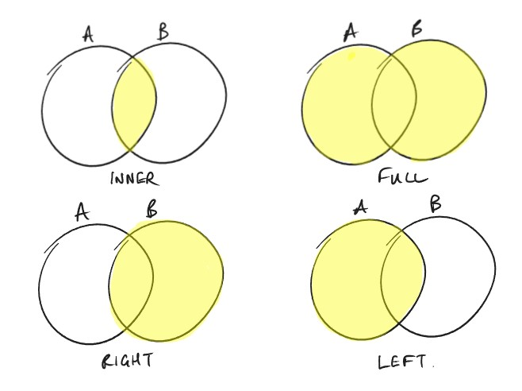

# Intro to Databases

Pretty much every organisation that holds data will have it in a database which makes it easier to store, manage, and retrieve the data. 
There are various different database options available, which are often tailored to specific use cases, however they all fit into one of two categories, SQL and NoSQL.

## Relational Databases (SQL)
### RDBMS

The software that lets you create, manage, and query databases, is called a **relational database management system**. Some popular ones include:
- MySQL
- PostgreSQL
- Microsoft SQL Server

### Practical 1
[Click here for the Practical 1 guide](Practical_1.md)
- Restore VM from Snapshot
- Install MySQL

### SQL Databases

Structured Query Language (SQL) is a database type which was developed in the 70’s, based on theoretical relational data models proposed in the 60’s. SQL databases are also known as relational databases.
SQL databases store data in tables which are defined by a schema. Each data item entered into the table must adhere to this schema.
You can create multiple tables, and then create relationships between them based on data items they have in common.

We're going to install a database engine (an RDBMS) on our Linux In a momr, but when done we need to create a database, in which we can create our tables to store our data. 

To create a database use the following SQL command.

```sql
CREATE DATABASE test_db;
```

We can then verify it was created with.

```sql
SHOW DATABASES;
```

Once created we need to move into that database so that we can start working with it.

```sql
USE test_db;
```

We can also delete databases with the DROP keyword.

```sql
DROP DATABASE test_db;
```

CREATE and DROP can also be used for tables, which we'll look at shortly. 

### The SQL Language

Although you can interact with SQL databases via a GUI, SQL was developed at a time when GUI’s were not common, and much like Linux, maximum compatibility is still achieved through the use of the standardised command set and syntax.

Many of the different types of SQL databases have their own additional features, such as supporting unique data types, or in some cases restrictions, such as naming conventions, but they should all support the standard SQL features and commands.

The SQL commands can be divided into sub-groups based on the type of functionality they provide:
- DDL - used to define the structure of the database and its objects such as tables, schemas, and indexes.
- DML - used to manipulate data within the database
- DQL - commands to retrieve data from the database
- DCL - used to manage access to the database by granting or revoking permissions.
- TCL - commands to manage transactions within a database to ensure data integrity.

SQL commands have simple syntax and conventions, compared to say Python or Bash. A basic SQL query looks like this - *Don't worry about what it does right now, we'll come back to it shortly*:

```sql
SELECT * FROM customers WHERE Name = “Company A”;
```

Commonly they’re split over multiple lines for readability. SQL doesn’t care about newlines, it looks for the semi-colon (;) to end the statement - missing the semi-colon is a common mistake, if your terminal is showing this prompt `->` it often means you missed the `;`.

```sql
SELECT * FROM customers 
WHERE Name = “Company A”;
```

One convention is that SQL keywords are capitalised, therefore for easy readability tables and fields are usually in lower case. **NOTE: SQL keywords are not case-sensitive, but database names, table names, and field names are.**

### SQL Tables

A database will typically contain multiple tables, but exactly which ones is up to you and your organisation’s needs. 

A common example when learning is to model a simple business which needs a customer_table, products_table, and an orders_table.

Tables in SQL are comprised of Fields (columns) and Records (rows), each record is an new entry in the database, and the fields are the data items captured for each record.

Every record in the table needs a unique identifier, known as a ‘Primary Key’, since two entries might have the same name.

When one table has a field for another table’s Primary Key, such as an Orders table referencing a Customer_ID number when they make a purchase, we call this a Foreign Key. 

Linking Primary and Foreign keys is how we create relationships between tables.

*Instructor prompt: WB*

### SQL Schema

Here is an example of creating a basic employee table and schema:

```sql
CREATE TABLE customers (
	customer_ID INT NOT NULL PRIMARY KEY,
	first_name VARCHAR(30),
	last_name VARCHAR(30),
	age INT UNSIGNED NOT NULL
);
```

As a reminder, recall that our SQL statements can be written on one long line, but using this format allows is easier because each line represents a field in the table, and that field's properties.

Like with the database, we can verify our table was created with `SHOW tables;`, but to ensure that all of our data types and additional options are configured correctly we can see a more detailed overview with

```sql
DESCRIBE customers;
```

We’re only using two data types in our customers table, INTs and VARCHARS, many more are available, and several standard ones worth reviewing…

### SQL Data Types

Although some of the different SQL databases have been developed to support niche data types and features, most standard data types are supported by all:
- INT = whole numbers, use UNSIGNED to restrict to positive numbers only.
- DECIMAL = decimal numbers to a defined precision e.g. DECIMAL(8, 2) stores up to 8 digits, with 2 after the decimal point. 
- CHAR(number) = a fixed length string
- VARCHAR(number) = a string up to the specified length
- DATE, TIME, DATETIME = yy-mm-dd, hh:mm:ss, YYYY-MM-DD hh:mm:ss
- BOOLEAN = true/false
And many others…

### Practical 2

[Click here for the Practical 2 guide](Practical_2.md)
- Practice creating and dropping databases and tables.
- Try to use CREATE, DROP, SHOW, USE, and DESCRIBE.

### Working with Data

Adding records to the database can be done in a number of ways. We are going to use standard SQL commands through the CLI, but this would not be suitable for a non-technical user.

Commonly a GUI can be created which translates user input into the appropriate SQL statements in the back-end, allowing these users to add and query data in a user-friendly environment.

Data can also be imported and exported in bulk using a variety of file types, a common option being CSV files.

### Inserting Records

Adding records into a table can be done with the INSERT statement as follows:

```sql
INSERT INTO customers (customer_ID, first_name, last_name, age) 
VALUES (1, 'Alice', 'Smith', 33);
```

As we're just learning, it's good practice to verfiy your record, you can do so by running a simple SELECT statement.

```sql
SELECT * FROM customers;
```

We'll come back to the SELECT statement shortly.

We'll look at some variations which can add multiple records at once through the CLI, but you should probably stick to one at a time for now to build familarity with the logic.

### Updating Records

To make changes to existing records use the UPDATE statement.

```sql
UPDATE customers
SET Age = 31
WHERE customer_ID = 1;
```

Notice the WHERE clause, this allows you to filter the records you retrieve from the database, in this case to make a simple update. But this is the key to retrieving with the SELECT statement, and gaining insights into your data. 

### Practical 3

[Click here for the Practical 3 guide](Practical_3.md)
- Create customers, and products tables with appropriate fields defined.
- Insert records into each table.
- Verify your records with `SELECT * FROM [table]`
- Update records.

### Selecting Records

Databases allow you to store, manage, and retrieve your data. Retrieval is about providing access to your data quickly and efficiently, for example looking up a customer’s records when then call in for support. 

```sql
SELECT *
FROM customers
WHERE customer_ID = 1;
```

The above example uses the wildcard `*` to return all fields, but you can also specify the specific fields you want.

```sql
SELECT first_name, last_name
FROM customers
WHERE customer_ID = 3;
```

Quick retrieval is one of the primary uses for a database, commonly GUI based applications which are easy for non-technical users to navigate and interact with, have databases in the back-end, such as a CRM system which looks up customer information when they call in for support; Or a web-based storefront, in which all of the product information is recalled from a database as the customer navigates the different items.

### Practical 4

[Click here for the Practical 4 guide](Practical_4.md)
- Create and populate tables
- Use SELECT statements to query tables

### More SELECT statements

#### Comparison Operators

Similar to Python, Bash, and many other environments, we can use comparison operators in our queries to further refine them, **but only against numeric values**.

```sql
SELECT first_name, last_name 
FROM customers 
WHERE age > 30;
```

The following comparison operators can be used

|Comparison         |Syntax |
|-------------------|-------|
|Equal              |=      |
|Not equal          |!=     |
|Greater            |>      |
|Greater or equal   |>=     |
|Less               |<      |
|Less or equal      |<=     |

#### String Patterns

We also have the ability to match patterns in strings, but we use the LIKE or NOT LIKE clauses in our SQL statements.  

|Pattern                    |Syntax        |
|---------------------------|--------------|
|Strings starting with 'abc'|'abc%'        |
|Strings ending with 'abc'  |'%abc'        |
|'abc' within the string    |'%abc%'       |
|Exactly X characters long  |'___' (3 here)|
|_ can be any character     |'a_c'         |

Here's an example of the syntax.

```sql
SELECT first_name, last_name 
FROM customers 
WHERE first_name LIKE 'Sc%';
```

The SELECT statement also allows you to analyse your data to identify patterns, trends, and answer questions. 

You can write queries to identify not only the best selling products, and the biggest spending customers, but also go deeper. What about the best selling products by geography, time of year, or both? Who are the biggest spending customers by age? Or any other summaries, or insights you can think of.

This extra insight might inform decisions for marketing teams, promotion planning, inventory purchasing, future investment, and so on…

#### Sorting Results

The ORDER BY clause allows you to specify the order your returned records will be displayed.

```sql
SELECT * FROM customers WHERE age <10 ORDER BY first_name;
```

You can provide multiple sort fields by seperating them with a comma.

```sql
SELECT * FROM customers WHERE age <10 ORDER BY last_name, first_name;
```

#### Deleting Records

The query syntax you're becoming familiar with can also be used to delete individual or multiple records as needed.

```sql
DELETE FROM customers WHERE first_name LIKE 'Alice';
```

### Practical 5

[Click here for the Practical 5 guide](Practical_5.md)
- Practice SELECT statements using comparison operators and pattern matching clauses.
- Practice using ORDER BY to sort your output. 
- Try DELETING records.

### Multiple Tables

#### Create the Tables

Most databases will require several tables, because for example, the customer table is not suitable for storing data related to the products you have in your inventory. So customers and products are separate tables, with different schemas according to the type of data to be stored.

We've already made multiple tables, but so far they aren't *related* to each other. Let's change that.

Ideally when one table references another it should reference the target table’s Primary Key, and we define the field in the new table as a FOREIGN key.

Hopefully your CREATE TABLE statements look something like the above example.

```sql
CREATE TABLE customers (
	customer_ID INT NOT NULL PRIMARY KEY,
	first_name VARCHAR(30),
	last_name VARCHAR(30),
	age INT UNSIGNED NOT NULL
);

CREATE TABLE products (
    product_id INT NOT NULL PRIMARY KEY,
    product_name VARCHAR(100),
    product_price DECIMAL(10,2)
);
```
Some tables are populated with data from others, our Orders table might take data from customers and products tables to make a new entry.

Now we're going to create an orders table which references both customers and products by creating foreign.

```sql
CREATE TABLE orders (
    order_id INT NOT NULL PRIMARY KEY,
    customer_id INT,
    product_id INT,
    order_date DATE,
    order_quantity INT,
    FOREIGN KEY (customer_id) REFERENCES customers(customer_id),
    FOREIGN KEY (product_id) REFERENCES products(product_id)
);
```

**The FOREIGN key and the PRIMARY key it references should contain the same data type and attributes or you'll likely get an error.**

#### Add some Records

Lets add some data to the tables. We'll also update our syntax to add multiple records at once. 

*It is recommended that you copy the following examples to a text editor and extend them so you have more data to work with before running them in MySQL*

```sql
-- Insert records into the customers table
INSERT INTO customers (customer_id, first_name, last_name, age)
VALUES
    (1, 'Alice', 'Smith', 33),
    (2, 'Alan', 'Jones', 28),
    (3, 'Noche', 'Snead', 3);

-- Insert records into the products table
INSERT INTO products (product_id, product_name, product_price)
VALUES
    (101, 'Ryzen 7 Laptop', 1299.99),
    (102, 'iPhone 14', 799.99),
    (103, '27" Monitor', 199.99);

-- Insert records into the orders table
INSERT INTO orders (order_id, customer_id, product_id, order_date, order_quantity)
VALUES
    (201, 1, 101, '2023-11-22', 2),
    (202, 2, 102, '2023-11-23', 1),
    (203, 3, 103, '2023-11-24', 3);
```

### Practical 6

[Click here for the Practical 6 guide](Practical_6.md)
- Make customers, products, and orders tables with `PRIMARY` and `FOREIGN` keys.
- Add records to them, and ensure you can query the individual tables.

#### Query Multiple Tables

Now we have records in each table, and two of the fields in the orders table reference unique fields (i.e. primary keys) in neighbouring tables.

We've already retrieved data from individual tables, and we can view orders from the orders table in the same way. With this table structure and primary/foreign key relationships, we can create more complex `SELECT` statements to retrieve data from related tables together.

For example, in our companies, let's say completed orders need to go to the Despatch Team for packing and postage. They look at the orders table, and it tells them what products to pick and package, *but where do they send it*? 

One option could be to duplicate the customer details from the customer table to the orders table when they place an order. 

*Question:* Why would this not be ideal?

*Answer:* The key reasons are:
- Data duplication is inefficient and wastes space on disk.
- If the data changes it needs to be changed in multiple locations. If the data doesn't match in different locations how would you know which one is accurate?

It would be better to retrieve the current customer contact details from the most up to date source, i.e. the customer table. We can do this because there is a relationship between the customer and orders tables in our *relational database*.

The following SQL statement will retrieve the customer's first and last name for a particular record in the orders table, even though this data is not stored in the orders table. 

```sql
SELECT customers.first_name, customers.last_name
FROM orders
JOIN customers ON orders.customer_id = customers.customer_id
WHERE orders.order_id = 201;
```

### Joins

JOIN operations combine rows from two or more tables based on a related column. In our example both tables share the `customer_id` field, so the above query:
1. Starts with the orders table and finds the record with `order_id 201`.
2. It then uses the `customer_id` from that record to find the corresponding record in the customers table, which it can do because they're joined on their related fields.
3. Finally, it selects the `first_name` and `last_name` from the appropriate record, and returns them as the result.

### Aliases

Review the previous SQL statement again, notice how many times the words *customer* and *orders* are used? It's not unusual for SQL statements to become tricky for humans to read accurately, especially as you start to have many similarly named tables, and you spend 8 hours per day staring at them (if you pursue a DB Admin career path).

Aliases allow you to define a more convenient or readable name for your tables which can be used elsewhere in your statements.

```sql
SELECT c.first_name, c.last_name
FROM orders o
JOIN customers c ON o.customer_id = c.customer_id
WHERE o.order_id = 201;
```

### Practical 7
[Click here for the Practical 7 guide](Practical_7.md)
- Experiment with the above syntax to create queries against multiple tables using the join statement.

### Join Types

There are three common types of joins:

- INNER - An `INNER` join returns results from both tables which match the query condition. Our example above is an Inner join, using `JOIN` or `INNER JOIN` will both create this type of query.

- FULL (OUTER) - A `FULL` or `OUTER` join returns results from both tables, even where results from one table doesn't match the condition. E.g.

|Student    |Course |Score  |
|-----------|------ |-------|
|Ant        |AWS    |Null   |
|Jess       |AWS    |90     |
|Richard    |AWS    |92     |
|Ant        |AZ     |89     |
|Jess       |AZ     |Null   |
|Richard    |AZ     |93     |

Let's say we wanted to know the exam scores for three students for the AWS and AZ exam, and the results are kept in separate tables; With an Inner Join we would only get results for Richard because only he has done both tests. With an Outer Join we can retrieve results with a NULL value.

- LEFT (OUTER) JOIN - Behaves like the Full Join, but it can only retrieve *none-matching* records from the left table, the table on the right's records must match the query condition. In the example table above, only the NULL values from AWS or AZ would return, you wouldn't get the NULLs from the other.

- RIGHT (OUTER) JOIN - As above, but the table on the right can return unmatched records, and the left must meet the query. FYI. When these JOINS refer to LEFT and RIGHT, that is the order you provide them in your SELECT statement.



### Transactions

Another key feature of SQL databases is support for transactions. 
A transaction is a sequence of operations performed as a single logical unit of work.

To understand the concept, consider most common transactions we rely upon each day - electronic payments. Money needs to be deducted from one account, and deposited in another - if either step fails, they should both fail, and be rolled back.

Transactions must adhere to the following ACID properties:
- Atomicity: Ensures that all operations within a transaction are completed successfully. If any operation fails, the entire transaction is rolled back.
- Consistency: Guarantees that a transaction transforms the database from one valid state to another.
- Isolation: Ensures that concurrent transactions do not interfere with each other.
- Durability: Ensures that once a transaction is committed, its changes are permanently stored.

**Don’t worry about the commands or syntax for transactions, at our level just appreciate that these types of operations are traditionally one of the key features and benefits of SQL databases.**

### Practical Challenge

- Model a company.

## Non-Relational (NoSQL) Databases

We'll now look at non-relational databases, but we're not going to get hands on, partly because they're a bit more straight forward, and you don't need to learn a whole new language to use them.

    NoSQL databases are a much more modern approach to storing and retrieving data. 

NoSQL databases still need a table to store data, but the table is not strictly defined. Records within the table can be completely different and unrelated to each other, and consist of completely different data types. 

    The lack of a strictly enforced schema is one of the key differences between SQL and NoSQL. 

Another big difference is in the name, non-relational, this means that we do not connect different tables together, and queries are therefore not typically about retrieving records from multiple locations, applying logic and filters to them. 

Instead, NoSQL queries are about SPEED! NoSQL DB's are best placed for quickly retrieving matching records, from perhaps billions, quickly. Does this sound like something you use regularly?

???

This type of database commonly powers internet search engines.

There are billions of web pages, and we just want to quickly retrieve results relevant to our key words - we don't do complex searches with multiple data sources, and various comparison operators, we filter them ourselves, we just want them quickly!

Some of the most commonly used NoSQL DBs include:

- MongoDB
- Cassandra
- DynamoDB (AWS)
- Cloud BigTable (GCP)
- Cosmos DB (Azure - includes SQL and NoSQL services)

### Database Scaling

Due to it's legacy nature, SQL databases are built around an assumption that your DB will be installed on a single powerful server. If you need more performance from your SQL DB, the main approach is to upgrade the server*. We call this **vertical scaling**, i.e. making a single resource more powerful by giving it more RAM, faster storage, more CPU cores, etc.

\* *Modern cloud providers have developed services to overcome this limitation, but that is outside of the scope of this module - we'll cover it in the cloud section*

NoSQL databases, having been developed in the era of virtualisation, are designed to work across multiple machines, or a **cluster**. To make this DB more powerful you can simply add more machines to the cluster. This is known as **horizontal scaling**.

When deploying to the cloud both scaling options are available, you can scale both vertically by deploying a more powerful VM, and horizontally by deploying more VM's to share the workload. However, one benefit of horizontal scaling is that in the case of a single server failure, your application or database can continue running on the remaining machines in the cluster.

### Records in a NoSQL Database

As mentioned, records in NoSQL DBs do not need to conform to a strict schema, this means that you can store any type of data in it. An entry could be a simple key value pair:

```
"Product_name" : "Frying Pan"
```

The value could be a link to an external resource:

```
"Product_image" : "http://[domain-name].com/[resource-path]"
```

Or, following a similar syntax to dictionaries in Python, a record could be a JSON object containing multiple KVP's which could be the attributes for that record:

```
"product_1" : {
    "name" : "Frying Pan",
    "image" : "http://scouts-catering.com/images/frying_pan.jpg",
    "size" : "12 inches",
    "colour" : "Green",
    "material" : "Copper",
    "induction" : "true"
    "non-stick" : "true"
    "price" : "19.99"
    }
```

However, as a catering supply company, I sell a lot more than frying pans. The next record in the DB could be:

```
"product_2" : {
    "name" : "Cling Film",
    "image" : "http://scouts-catering.com/images/cling_film.jpg",
    "length" : "500m",
    "width" : "60cm",
    }
```

Notice that the attributes for the cling film are different to the frying pan.

Since I have all of this cookware, maybe I'll make and sell cakes too:

```
"product_2" : {
    "name" : "Chocolate Cake",
    "image" : "http://scouts-catering.com/images/chocolate_cake.jpg",
    "Servings" : {
        "size_1" : 12,
        "size_2" : 18,
        "size_3" : 24
        }
    "Weight" : {
        "size_1" : 1.5kg,
        "size_2" : 2.0kg,
        "size_3" : 2.5kg
    }
    "ingredients" : ["flour", "eggs", "milk", "sugar", "butter", "cocoa"]
    }
```

This is a slightly more complex JSON object, the values for they keys `Servings` and `Weight` are both individual JSON objects with multiple KVPs, representing different cake options. The `ingredients` key has multiple values, which I've provided with a JSON array (list).

In addition to JSON objects and strings your NoSQL DB can store a variety of other data types, including binary data - Since all files and objects on our computers are actually binary at the lowest level, we can basically put anything digital into our DBs.

## Comparing SQL and NoSQL

When comparing the two categories of databases, there are a few points we've already covered:

|   | SQL  | NoSQL  |
|---|---|---|
|Schema   |Fields and records must conform to a strict schema, defined when you create the table.  |Records do not have to follow a strict schema.|
|Scaling|Typically limited to vertical scaling|Supports horizontal scaling|
|Use cases|Designed for complex queries and transactions|Designed for rapid retrieval|

But there are more factors to be aware of. 

### Data Structure

Organisations have access to vast amounts of data, much of which they can generate themselves, such as sales records, productivity data, financial data, etc. There are also lots of external sources, some is publicly accessible, some can be purchased from 3rd parties. This could include weather data, demographic info, market analysis reports, etc.

#### Structured Data

Generally speaking, when looking at a piece of data, if it has a clear meaning, we call this structured data.

Consider `3665156958940023`, `01704568473`, or `150876`; Out of context these could be anything, but if we label them `card_no`, `tel`, and `DOB` suddenly they make sense. 

In these cases we could enter them into a SQL database, and define the appropriate schema to ensure the data is added correctly - so the card field will not accept letters, and the DOB field only takes 6 numberical characters, and so on. 

These are examples of structured data - the meaning of the data is clear, and it is suitable for adding to a SQL database.

One of the reasons we want our data to be structured is so that we can use to add value to our organisation, by informing decision making.

What products sell best, at what time of the year, in what region? You can construct SQL queries, to reveal these answers, assuming you have the relevant data.

#### Unstructured Data

Predictably, unstructured data is the opposite of structured, i.e. it is data which does not have a clear inherent meaning. This could be data which is gathered and stored, often in large quantities, such as log entries, sensor values, measurements, traffic data, etc. This data is often captured and dumped into text files, such as txt, CSV, JSON, XML, and others.

Let's take an extract from a line in a CSV (comma separated values) file, which could be a log entry:

`12:45:54:12.01.25,24.101.57.13:54987,12:34:56:AB:CD:EF,197.165.1.24:443,centos`

As it is, it's difficult to make any sense of the above string or use it effectively in queries, so it's unstructured. 

Often unstructured data can be transformed into structured. In this case, if we could provide context, such as:

`HH:MM:SS:DD:MM:YY,SRC_IP:PORT,SRC_MAC,DST_IP,UNAME`

This line identifies each unique piece of information in the log enrty above, delineated by commas, and will usually (hopefully) be defined on the first line of a CSV. This can be used to define your relational database' table schema, allowing you to import the data into a SQL database. This in turn allows it to be used in queries, so you can gain business value and inform decisions.

### Data Pipelines

A data pipeline describes the path data takes from being gathered, to being useable. A typical pipeline looks like this:

            Data Lake --> Data Warehouse --> Database

- A Data-Lake, into which RAW unstructured data can be deposited. 
- Unstructured data from the lake can be extracted, and transformed into a semi-structured format, suitable for storing in a Data Warehouse.
- Semi-structured data from the warehouse can then be transferred into a NoSQL DB if no further structure is necessary, or transformed into a structured format for ingestion into a SQL database.